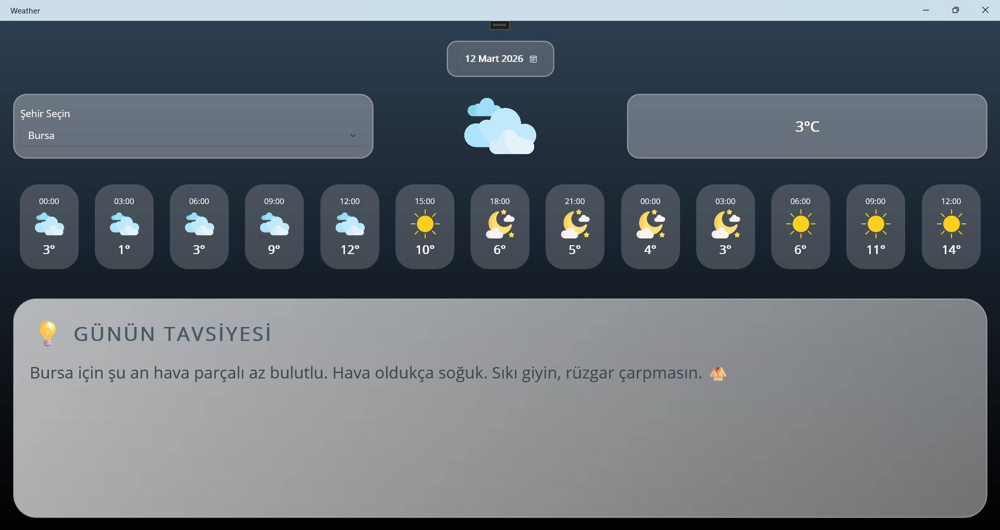
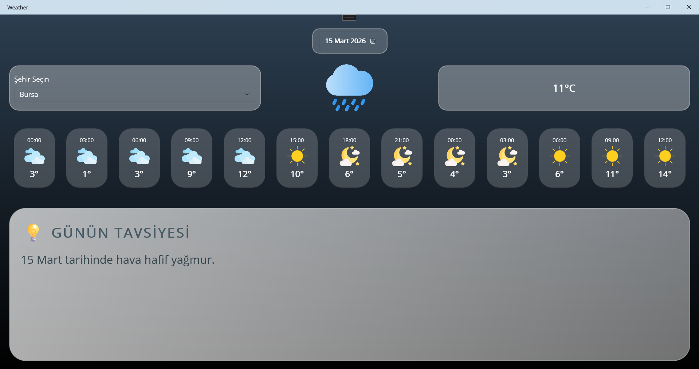
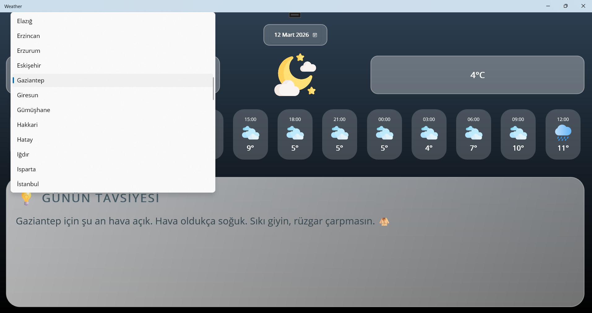
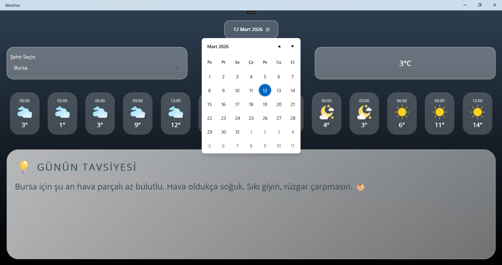

## 🌦️ WeatherApp - Akıllı Hava Durumu Rehberi ##
.NET MAUI ile geliştirilmiş, hem göze hem de ihtiyaca hitap eden modern bir hava durumu uygulaması. Sadece dereceyi söylemekle kalmaz, size ne giymeniz gerektiğini de fısıldar!

## ✨ Özellikler ##
**Canlı Veri:** OpenWeatherMap API entegrasyonu ile anlık ve 5 günlük hava durumu tahmini.

**SQL Entegrasyonu:** Şehir listesini yerel bir SQL Server (SQLEXPRESS) üzerinden dinamik olarak çeker.

**Akıllı İkonlar:** Havanın durumuna (Bulutlu, Yağmurlu, Karlı vb.) ve Gündüz/Gece ayrımına göre otomatik değişen görsel ikonlar. (Geceleri Ay, gündüzleri Güneş!).

**Kişiselleştirilmiş Tavsiyeler:** Sıcaklığa ve yağış durumuna göre "Şemsiyeni al" veya "Sıkı giyin" gibi dostça tavsiyeler.

**Saatlik Tahmin Listesi:** Önümüzdeki 36 saati kapsayan şık, yatay kaydırılabilir (Carousel tarzı) tahmin kartları.

**Tarih Seçici:** Gelecek günlerin hava durumuna hızlıca göz atma imkanı.

## 🛠️ Kullanılan Teknolojiler ##
**Framework:** .NET MAUI (Multi-platform App UI)

**Dil:** C#

**Veritabanı:** Microsoft SQL Server (SqlClient)

**API:** OpenWeatherMap API

**Kütüphane:** Newtonsoft.Json (Veri işleme için)

## 🚀 Kurulum ve Çalıştırma ## 
*API Anahtarı:* MainPage.xaml.cs dosyasındaki ApiKey değişkenine kendi OpenWeatherMap anahtarınızı ekleyin.

*Veritabanı:* SQL Server'da Weather adında bir veritabanı oluşturun.

City tablosu ekleyip içine CityName kolonunu tanımlayın ve birkaç şehir ekleyin.

connectionString içindeki Server adını kendi yerel sunucunuzla güncelleyin.

*Görseller:* Resources/Images klasöründeki ikonların "Build Action" özelliğinin MauiImage olduğundan emin olun.

## 📸 Ekran Görüntüleri ##

